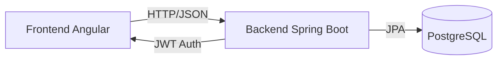

# Skillink Frontend - UPC


Interfaz web del sistema Skillink que conecta estudiantes con asesores académicos. Desarrollado en el sexto ciclo de Ingeniería de Sistemas de Información - UPC.

## Descripción

Aplicación web que permite a estudiantes buscar, filtrar y reservar asesorías con especialistas. Interfaz moderna desarrollada en Angular conectada al backend mediante API REST.

## Equipo de Desarrollo

- **Nelson Alejandro** 
- **Javier Chumpitazi**
- **Lehonel Cachay**
- **Jose Matos**
- **Jhair Martel**

*Proyecto del ciclo 2025-2 - Ingeniería de Sistemas de Información UPC*

## Tecnologías

- Angular 20.3.7
- TypeScript
- Angular Material
- RxJS
- HttpClient

## Características

Login y registro de usuarios  
Búsqueda y filtrado de asesores  
Sistema de creación de asesorías  
Panel de usuario y asesor

## Instalación

### Prerrequisitos
- Node.js 18 o superior
- npm 9 o superior
- Angular CLI 20

### Pasos

1. **Clonar el repositorio**
```bash
git clone https://github.com/Nelson-Alejandro/skillink-frontend-upc.git
cd skillink-frontend-upc
```

2. **Instalar dependencias**
```bash
npm install
```

3. **Configurar conexión con el backend**

Asegúrate de tener el backend corriendo en `http://localhost:8080`

4. **Ejecutar en desarrollo**
```bash
ng serve
```

La aplicación estará disponible en: `http://localhost:4200`

## Comandos de Desarrollo

### Servidor de desarrollo
```bash
ng serve
```

### Generar componentes
```bash
ng generate component nombre-componente
```

### Build de producción
```bash
ng build
```

### Ejecutar tests
```bash
ng test
```

## Integración con Backend

Este frontend se conecta con la API REST del backend:

**Backend Repository**: [skillink-backend-upc](https://github.com/Nelson-Alejandro/skillink-backend-upc.git)

### Arquitectura


## Autenticación

- Sistema de login con JWT tokens
- Rutas protegidas con Guards
- Interceptores HTTP para autorización automática
- Gestión de sesiones

## Estructura del Proyecto
```
src/
├── app/
│   ├── administrador/              # Módulo de administrador
│   │   ├── tabla-asesores/
│   │   ├── tabla-asesorias/
│   │   ├── tabla-clientes/
│   │   ├── administrador-module.ts
│   │   └── administrador-routing-module.ts
│   ├── asesor/                     # Módulo de asesor
│   │   ├── asesorasesorias/
│   │   ├── asesorsoporte/
│   │   ├── crear-asesor/
│   │   ├── crear-asesoria/
│   │   ├── homeasesor/
│   │   ├── asesor-module.ts
│   │   └── asesor-routing-module.ts
│   ├── asesorias/                  # Gestión de asesorías
│   ├── expertos/                   # Sección de expertos
│   ├── guards/                     # Guards de rutas
│   ├── home/                       # Página principal
│   ├── interceptors/               # Interceptores HTTP
│   ├── nosotros/                   # Página "Nosotros"
│   ├── recuperar/                  # Recuperar contraseña
│   ├── registro/                   # Registro de usuarios
│   ├── services/                   # Servicios
│   │   ├── asesoria.ts
│   │   ├── auth.ts
│   │   └── ver-asesoria.ts
│   ├── soporte-tecnico/            # Soporte técnico
│   ├── unete/                      # Únete como asesor
│   ├── usuario/                    # Módulo de usuario
│   │   ├── homeusuario/
│   │   ├── usuarioasesorias/
│   │   ├── usuarioexpertos/
│   │   ├── usuarionosotros/
│   │   ├── usuariosoporte/
│   │   └── usuario-routing-module.ts
│   ├── ver-asesor/                 # Ver perfil de asesor
│   ├── ver-asesoria/               # Ver detalle de asesoría
│   ├── app.config.ts               # Configuración de la app
│   ├── app.css                     # Estilos globales
│   ├── app.html                    # Template principal
│   ├── app.routes.ts               # Rutas principales
│   └── app.ts                      # Componente raíz
├── assets/                         # Recursos estáticos
│   └── img/                        # Imágenes
├── custom-theme.scss               # Tema personalizado
├── index.html                      # HTML principal
├── main.ts                         # Punto de entrada
└── styles.css                      # Estilos globales
```

## Rutas Principales

- `/login` - Inicio de sesión
- `/register` - Registro de usuario
- `/home` - Página principal
- `/asesorias` - Listado de asesorías

## Contribución

Este es un proyecto académico desarrollado en el sexto ciclo de la carrera.

1. Crea una rama para tu feature (`git checkout -b feature/NuevaCaracteristica`)
2. Commit tus cambios (`git commit -m 'feat: agregar nueva característica'`)
3. Push a la rama (`git push origin feature/NuevaCaracteristica`)
4. Abre un Pull Request

## Licencia

Este proyecto es desarrollado con fines académicos como parte del curso de Arquitectura de Aplicaciones Web en la UPC.

## Contacto

**Universidad Peruana de Ciencias Aplicadas (UPC)**  
Carrera: Ingeniería de Sistemas de Información  
Ciclo: 2025-2
